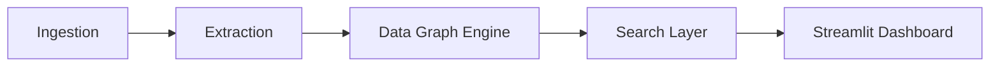

# Nexus: Intelligent Data Graph & Search System


A mission-critical data intelligent engine designed for unified information extraction, graph-based relationship mapping, and semantic search. Nexus provides a scalable platform for ingesting heterogeneous data, building multi-dimensional relationship graphs, and querying information through a sleek interactive dashboard.

## Table of Contents
- [Tech Stack & Architecture](#tech-stack--architecture)
- [Prerequisites](#prerequisites)
- [Installation & Local Setup](#installation--local-setup)
- [Usage & Running the App](#usage--running-the-app)
- [Testing](#testing)
- [Deployment](#deployment)
- [Contributing Guidelines](#contributing-guidelines)
- [License and Contact](#license-and-contact)

## Tech Stack & Architecture

### Core Technologies
- **Inference & UI**: `Streamlit` (Interactive data console)
- **Data Science**: `Pandas`, `NumPy`
- **Orchestration**: `Python` v3.11+
- **Dependency Management**: `uv`

### High-Level Architecture
Nexus is built on a modular, pipeline-driven architecture:
- **`ingestion/`**: Handles the intake and sanitization of raw datasets.
- **`extraction/`**: Logic for distilling semantic entities and metadata from raw sources.
- **`graph/`**: The core relationship mapping engine, building multi-node graphs of interconnected data points.
- **`search/`**: High-performance semantic and keyword-based search orchestration.



## Prerequisites
- **Python**: v3.11+
- **Tools**: `uv` package manager mandated for reliable dependency resolution.
- **System**: Bash/Zsh environment for initialization scripts.

## Installation & Local Setup

```bash
git clone https://github.com/DragoCodes/Nexus.git
cd Nexus
uv sync
```

### Rapid Initialization
Initialize the environment and verify dependencies with the built-in setup script:
```bash
bash setup.sh
```

## Usage & Running the App

### Start the Nexus Console
Launch the interactive visualization dashboard:
```bash
uv run streamlit run streamlit_demo.py
```
By default, the dashboard will start on **`http://localhost:8501`**.

### CLI Execution
For headless processing and graph generation:
```bash
uv run python main.py
```

## Testing
- **Command**: `uv run pytest tests/`
- **Focus**: Validates extraction accuracy, graph node consistency, and search retrieval performance.

## Deployment
Nexus is optimized for cloud deployment. Package the system into a Docker image using the provided `pyproject.toml` and deploy the Streamlit frontend to cloud providers like Azure App Service, AWS Elastic Beanstalk, or Google App Engine.

## Contributing Guidelines
1. Branch from `current-master`.
2. Follow **Trunk-based development**.
3. Use **Conventional Commits**: `feat: add Neo4j graph connector`.
4. Peer-review required based on architectural guidelines defined in `commands.md`.

## License and Contact
- **License**: MIT
- **Contact**: DragoCodes (https://github.com/DragoCodes)
