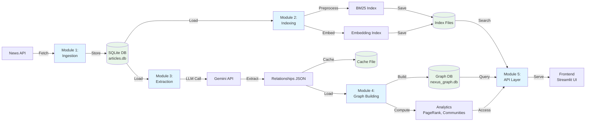
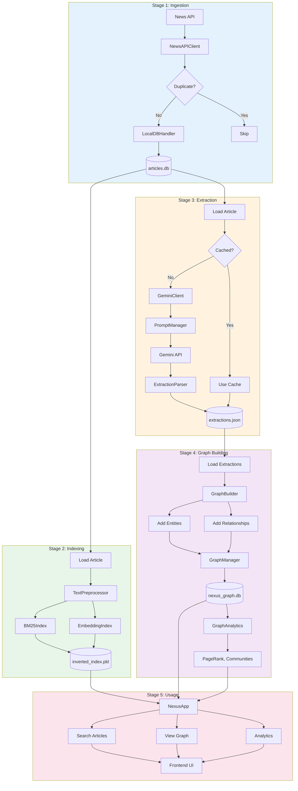

# Article Lifecycle - Simplified Flowchart

```mermaid
flowchart LR
    A[News API] -->|Fetch| B[Module 1:<br/>Ingestion]
    B -->|Store| C[(SQLite DB<br/>articles.db)]
    
    C -->|Load| D[Module 2:<br/>Indexing]
    D -->|Preprocess| E[BM25 Index]
    D -->|Embed| F[Embedding Index]
    E -->|Save| G[(Index Files)]
    F -->|Save| G
    
    C -->|Load| H[Module 3:<br/>Extraction]
    H -->|LLM Call| I[Gemini API]
    I -->|Extract| J[Relationships JSON]
    J -->|Cache| K[(Cache File)]
    
    J -->|Load| L[Module 4:<br/>Graph Building]
    L -->|Build| M[(Graph DB<br/>nexus_graph.db)]
    L -->|Compute| N[Analytics<br/>PageRank, Communities]
    
    G -->|Search| O[Module 5:<br/>API Layer]
    M -->|Query| O
    N -->|Access| O
    
    O -->|Serve| P[Frontend<br/>Streamlit UI]
    
    style B fill:#e1f5ff
    style D fill:#e1f5ff
    style H fill:#e1f5ff
    style L fill:#e1f5ff
    style O fill:#e1f5ff
    style C fill:#e8f5e9
    style G fill:#e8f5e9
    style K fill:#e8f5e9
    style M fill:#e8f5e9
```

## Stage-by-Stage Flow

```mermaid
graph TD
    subgraph Stage1["Stage 1: Ingestion"]
        A1[News API] --> A2[NewsAPIClient]
        A2 --> A3{Duplicate?}
        A3 -->|No| A4[LocalDBHandler]
        A3 -->|Yes| A5[Skip]
        A4 --> A6[(articles.db)]
    end
    
    subgraph Stage2["Stage 2: Indexing"]
        B1[Load Article] --> B2[TextPreprocessor]
        B2 --> B3[BM25Index]
        B2 --> B4[EmbeddingIndex]
        B3 --> B5[(inverted_index.pkl)]
        B4 --> B5
    end
    
    subgraph Stage3["Stage 3: Extraction"]
        C1[Load Article] --> C2{Cached?}
        C2 -->|Yes| C3[Use Cache]
        C2 -->|No| C4[GeminiClient]
        C4 --> C5[PromptManager]
        C5 --> C6[Gemini API]
        C6 --> C7[ExtractionParser]
        C7 --> C8[(extractions.json)]
        C3 --> C8
    end
    
    subgraph Stage4["Stage 4: Graph Building"]
        D1[Load Extractions] --> D2[GraphBuilder]
        D2 --> D3[Add Entities]
        D2 --> D4[Add Relationships]
        D3 --> D5[GraphManager]
        D4 --> D5
        D5 --> D6[(nexus_graph.db)]
        D6 --> D7[GraphAnalytics]
        D7 --> D8[PageRank, Communities]
    end
    
    subgraph Stage5["Stage 5: Usage"]
        E1[NexusApp] --> E2[Search Articles]
        E1 --> E3[View Graph]
        E1 --> E4[Analytics]
        E2 --> E5[Frontend UI]
        E3 --> E5
        E4 --> E5
    end
    
    A6 --> B1
    A6 --> C1
    C8 --> D1
    B5 --> E1
    D6 --> E1
    D8 --> E1
    
    style Stage1 fill:#e3f2fd
    style Stage2 fill:#e8f5e9
    style Stage3 fill:#fff3e0
    style Stage4 fill:#f3e5f5
    style Stage5 fill:#fce4ec
```

